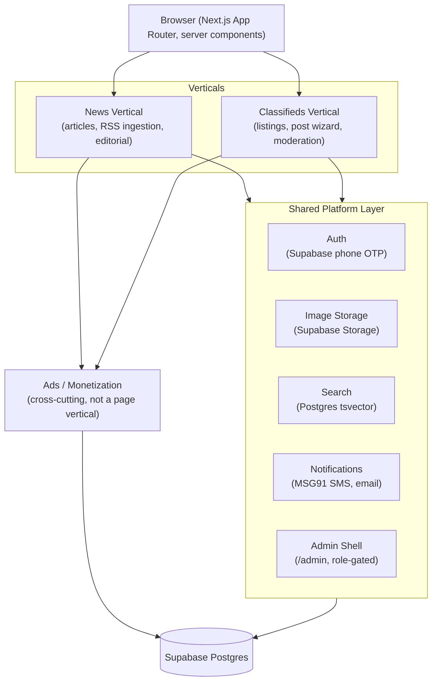

# Trichy Today — Architecture

Companion to `ROADMAP.md` (the *what* and *when*). This document covers the *how* — system shape, vertical boundaries, and the order we build things in so verticals can progress independently without stepping on each other.

---

## Guiding Principles

1. **Monolith-first.** One Next.js app, one Postgres database (Supabase). News and Classifieds are logical verticals — separate tables, routes, and components — not separate services or deployments. Revisit only if traffic/scale actually demands it (see Non-Goals).
2. **Shared platform, independent verticals.** Auth, storage, search, and notifications are built once beneath both verticals. Once that foundation exists, News and Classifieds can be built, tested, and shipped in parallel because they touch disjoint tables and routes.
3. **The data-access seam already exists — don't break it.** `types/ → lib/mock-data/ → lib/data/ (async) → server component` is the current pattern. Migrating to Supabase means rewriting the insides of `lib/data/*.ts` only. Pages and components should not need to change. This is what makes Phase 1 low-risk.

---

## System Overview



---

## Verticals

### News Vertical
- **Inputs:** RSS ingestion worker (cron, 3–5 TN feeds), manual admin authoring, user submissions (`/post/news`)
- **Pipeline:** ingest → dedupe against `rss_ingestion_log` (by GUID) → moderation queue → published → cached read path → indexed for search
- **Owns:** `news_articles` table, `app/news/**` routes, `NewsCard`, admin news editor, breaking-news ticker
- **Read-path perf:** ISR, revalidate every 5 min (per ROADMAP Phase 5)

### Classifieds Vertical
- **Inputs:** user post wizard (`/post/classified`, 3-step)
- **Pipeline:** draft → pending → moderation → active → optional premium boost → expires at 60 days or renewed
- **Owns:** `classified_listings` table, `app/classifieds/**` routes, `ClassifiedCard`, `PostClassifiedForm`, My Listings page
- **Cross-cutting concern specific to this vertical:** phone number masking — full number never rendered server-side, revealed only via a logged API call (ROADMAP Phase 3, not yet implemented — see CLAUDE.md convention)

### Ads / Monetization
Not a page-level vertical — it's a layer injected into both News and Classifieds surfaces (`SponsoredBanner`, placements table). Owns `company_ads`, billing via Razorpay. Depends on both verticals existing (needs pages to place ads on, users to bill) but doesn't block either.

---

## Shared Platform Layer

| Layer | Used by | Notes |
|---|---|---|
| **Auth** (Supabase, phone OTP) | Both verticals + admin | One login: posting a classified, submitting news, and admin access all gate on the same `users.role` |
| **Storage** (Supabase Storage) | Both verticals | Same bucket pattern, different folders/policies — news hero images vs. classified photos |
| **Search** (Postgres `tsvector`) | Both verticals | Single `/search` surface federating `news_articles` and `classified_listings` — no separate search service |
| **Notifications** (MSG91 SMS, email) | Both verticals | Event-driven: listing approved, article published, expiry reminder — same dispatch code, different templates |
| **Admin** (`/admin`) | Both verticals | One shell, one auth guard, tabs per vertical (news queue / classifieds queue / ad manager) |

Building this layer is **Stage A** below — nothing vertical-specific should be built before it, since both verticals need it to do anything real (auth to post/submit, storage to upload images).

---

## Build Stages

Stages describe *architectural* sequencing — which layers unlock which other layers. They map onto `ROADMAP.md` phases but are organized around what can run in parallel.

```
Stage A — Shared Foundation                     (ROADMAP Phase 1)
  Supabase project + schema, phone OTP auth, storage buckets, env config.
  Blocks everything else. Build once, not per-vertical.

Stage B — Verticals, in parallel                (ROADMAP Phase 2 + 3)
  ├─ News track:        RSS worker → admin news editor → moderation queue
  └─ Classifieds track: post flow → moderation → phone masking → filters → My Listings
  These touch disjoint tables/routes and only share Stage A — safe to build
  concurrently (different sessions, different people, whatever).

Stage C — Cross-cutting, layered on top         (ROADMAP Phase 5 + 6)
  Search, SEO/structured data, ISR tuning, SMS/email notifications.
  Additive — touches both verticals but doesn't block Stage B work.

Stage D — Monetization                          (ROADMAP Phase 4)
  Premium listings, ad billing, renewals. Sits atop both verticals —
  needs real user accounts and real listings/articles to attach to.

Stage E — Ops & Legal                            (ROADMAP Phase 7 + 8)
  Deploy, monitoring, legal pages. Can start in parallel, must finish
  before public launch.
```

The key departure from a purely phase-by-phase read of `ROADMAP.md`: **Stage B is two independent tracks.** Once Stage A lands, News ingestion/admin and Classifieds post-flow/moderation don't need to be built in sequence — they don't share code or tables beyond auth/storage.

---

## Explicit Non-Goals (avoid over-engineering)

Per CLAUDE.md's "do not over-engineer" — these are deliberately *not* part of the plan until traffic or team size actually forces the issue:

- **No microservices / per-vertical deployments.** Single Next.js app, single database.
- **No dedicated search service** (Elasticsearch, Algolia, etc.). Postgres full-text search covers this scale.
- **No message queue / event bus** between verticals. Direct DB writes plus cron jobs (RSS worker, expiry sweep) are sufficient.
- **No GraphQL layer.** Server components calling `lib/data/*` directly is enough.

---

## Open Questions

- SMS/email provider is decided (MSG91, Resend/SendGrid per ROADMAP) — Razorpay is decided for payments. No other open infra decisions right now.
- Whether RSS ingestion runs as a Vercel Cron function or a separate small worker — deferred until Stage B/News track starts.
